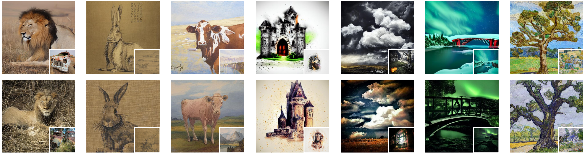
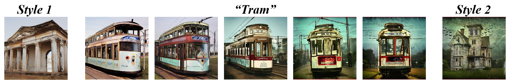

# [InstaStyle: Inversion Noise of a Stylized Image is Secretly a Style Adviser (ECCV2024)](https://arxiv.org/abs/2311.15040)
[Xing Cui](),
[Zekun Li](),
[Peipei Li](),
[Huaibo Huang](),
[Xuannan Liu](),
[Zhaofeng He]()

[](https://cuixing100876.github.io/instastyle.github.io/)
[](https://arxiv.org/abs/2311.15040)
[](https://arxiv.org/abs/2311.15040)

---

[//]: # (https://user-images.githubusercontent.com/54032224/302051504-dac634f3-85ef-4ff1-80a2-bd2805e067ea.mp4)

## 🚩 **New Features/Updates**
- **TODO** Release **InstaStyle** with StableDiffusion v2.1.
- [2024/07/11] Release the code of **InstaStyle**.
- [2024/07/02] **InstaStyle** is accepted by 🌈 ECCV 2024.

---

# Introduction
**InstaStyle** is a powerful method for stylized image generation. The core idea of InstaStyle is based on the finding that the inversion noise from a stylized reference image inherently carries the style signal. 
It can perform stylized image generation given only one reference image.
Besides, **InstaStyle** can generate images in a combined sytle and supports adjusting the degree of
two styles during combination, demonstrating its flexibility.

# 🔥🔥🔥 Main Features  
### **Stylized image generation with a single reference image**  
**InstaStyle** excels at capturing style details including colors, textures, and brush strokes.
<p align="center">
  
</p>

### **Combination of two styles**  
**InstaStyle**  supports adjusting the degree of two styles during combination, dynamically ranging from one style to another.


<p align="center">
 
</p>


# 🔧 Dependencies and Installation

- Python = 3.11.4
- [PyTorch= 2.0.1, torchvision=0.15.2 ]( https://pytorch.org/get-started/previous-versions/) 

```bash
# create an environment
conda create -n instastyle python==3.11.4
# activate the environment
conda activate instastyle
# install pytorch using pip
# for example: for Linux with CUDA 11.7
pip install torch==2.0.1 torchvision==0.15.2 torchaudio==2.0.2
# install other dependencies
pip install -r requirements.txt
# diffusers
pip install diffusers==0.21.0
# install xformers 
pip install -U xformers==0.0.21
```

# ⏬ Download Diffuser Models from Hugging Face (Optional)
The diffuser model can be downloaded automatically when the path is specified as "CompVis/stable-diffusion-v1-4", but we recommend that users download the model locally. 

By running download.py, the stable diffusion model will be saved to "./stable-diffusion-v1-4"
```bash
python download.py
```

# 💻 Quick run
The experiment can be carried out on a  NVIDIA GeForce RTX 3090 GPU with 24g memory.

We provide a quick start on gradio demo.
```bash
python app.py
```

# Related Works
[1] <a href="https://arxiv.org/abs/2306.00983"> StyleDrop: Text-to-Image Generation in Any Style</a>
</p>
<p>
[2] <a href="https://arxiv.org/abs/2306.00763">Learning disentangled prompts for compositional image synthesis</a>
</p>


# 🤗 Acknowledgements
We appreciate the foundational work done by [Null-Text Inversion](https://github.com/google/prompt-to-prompt/#null-text-inversion-for-editing-real-images) and [CustomDiffusion](https://arxiv.org/abs/2305.10973).
This readme file is modified from [Dragon Diffusion](https://github.com/MC-E/DragonDiffusion) and we thank them for their work.
# BibTeX
    @inproceedings{cui2024instastyle,
      title={InstaStyle: Inversion Noise of a Stylized Image is Secretly a Style Adviser},
      author={Cui, Xing and Li, Zekun and Li, Pei Pei and Huang, Huaibo and Liu, Xuannan and He, Zhaofeng},
      booktitle={ECCV},
      year={2024}